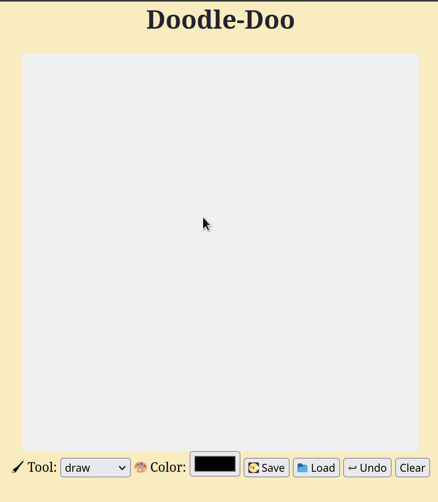

# PixelEditor
Simple Drawing tool for creating pixel art


Checkout [Doodle-Doo](https://joeydelizza.github.io/DoodleDoo) to see it in action

## To Use:
Use the appendChild() of the Node interface to add the PixelEditor object

## Example:

```html
<html>
  <body>

    <script src="PixelEditor.js"></script>

    <div></div>
    <script>
      document.querySelector("div").appendChild(startPixelEditor({}));
    
    </script>

  </body>
</html>
```
